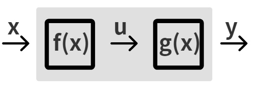

# 미분_01

## 1. 미분계수(접선의 기울기)

- 미분은 함수를 한없이 작게 나누는 분석
- 이전에 우리는 평균변화율이 다음과 같다는 것을 알았다.

$$
평균변화율 = \frac{f(b) - f(a)}{b-a}
$$

- 평균변화율을 구하는 식에서 **x의 변화량(b - a)을 극한으로 줄이면**,  그래프의 접선에서의 기울기를 구할 수 있다.

- 이렇게 해서 미분계수(접선의 기울기)를 구하는 공식을 도출하면

$$
f'(a) = \lim_{b\to a}\frac{f(b)-f(a)}{b-a}
$$

- 극한으로 줄이는 위의 식에서 `b-a=h`라 하면 `b=a+h`가 되고 `b->a`일 때 `h->0`이므로

$$
f'(a) = \lim_{h\to 0}\frac{f(a+h)-f(a)}{h}
$$

- x는 a에서 접선의 기울기를 구할 수 있다.

## 2. 순열과 조합 그리고 이항정리

### 2.1 순열

- 서로 다른 n개에서 순서를 고려하여 r개를 뽑는 경우의 수

$$
_n\mathrm{P}_r = n \times (n-1) \times (n-2) \times ... \times (n-r+1)
$$

### 2.2 조합

- 서로 다른 n개에서 순서를 고려하지 않고 r개를 뽑는 경우의 수

$$
_n\mathrm{C}_r = \frac{_n\mathrm{P}_r}{r!}=\frac{n \times (n-1) \times (n-2) \times ... \times (n-r+1)}{r \times (r-1) \times (r-2) \times ... \times 1}
$$

### 2.3 이항정리

$$
(a+b)^2 = a^3  + 3a^2b + 3ab^2 + b^3 \\ (a+b)^n을 \space전개한 \space식에서\space a^{n-k}b^k의\space 계수는\space _n\mathrm{C}_k \\ (a+b)^n = {}_n\mathrm{C}_0a^n +{}_n\mathrm{C}a^{n-1}b + {}_n\mathrm{C}a^{n-2}b^2 + ... + {}_n\mathrm{C}_nb^n
$$

## 3. 미분계수 공식 유도

$$
f'(a) = \lim_{h\to 0}\frac{f(a+h)-(a)}{h} 에서\\ f(x) = x^n 이라면 \\ f'(a) = \lim_{h \to0}\frac{(a+h)^n - a^n}{h} .........1번 \\ 여기서 \space(a+h)^n을 \space이항정리 하면 \\ (a+h)^n = {}_n\mathrm{C}_0a^n +{}_n\mathrm{C}a^{n-1}h + {}_n\mathrm{C}a^{n-2}h^2 + ... + {}_n\mathrm{C}_nh^n \\ = a^n + na^{n-1}h+\frac{n(n-1)}{2}a^{n-2}h^2 +...+ h^n .......... 2번 \\ 2번 식을 \space 1번에  \space 대입하여 \space풀면 \\ f'(a) = na^{n-1}
$$

- 위와 같이 미분계수 공식
  $$
  f'(a) = na^{n-1}
  $$
  를 구할 수 있다.

## 4. 합성함수의 미분

- 상자 f(x)와 g(x)를 합쳐서 만든 함수 h(x)를 **합성함수**라고 한다.

$$
f'(x) = \lim_{h\to 0}\frac{f(x+h)-f(x)}{h} =y'= \lim_{\Delta\to0}\frac{\Delta y}{\Delta x} = \frac {dy}{dx}
$$

- 위와 같이 도함수는 여러가지 방법으로 표현할 수 있다.

$$
\{g(f(x))\}'=g'(f(x))\cdot f'(x)
$$
- 합성함수의 미분은 위와 같이 할 수 있다.

- 예시
  $$
  h(x) =(x^2+3)^6 \space 일 \space 때\\ h'(x) =\{(x^2+3)^6\}'=6(x^2+3)^5 \cdot 2x = 12x(x^2+3)^5
  $$

## 5. 곱과 몫의 미분

### 5.1 곱의 미분

$$
\{f(x)g(x)\}' = f'(x)g(x) + f(x)g'(x)
$$

### 5.2 몫의 미분

- 몫의 미분은 보통 분수 꼴의 함수를 미분할 때 사용한다.

$$
\left \{ \frac{f(x)}{g(x)} \right  \}' = \frac{f'(x)g(x) - f(x)g'(x)}{\{g(x)\}^2}
$$

## 6. 삼각함수

### 6.1 삼각비

$$
\cos\theta=\frac{x}{r}, \space \sin\theta=\frac{y}{r}, \space \tan\theta=\frac{y}{x}
$$

$$
x = r\cos\theta \\ y=r\sin\theta \\ \frac{y}{x}=\frac{r\sin\theta}{r\cos\theta}=\tan\theta
$$

- 삼각함수의 상호 관계

$$
\tan\theta = \frac{\sin\theta}{\cos\theta} \\\cos^2\theta + \sin^2\theta=1
$$

- 음각, 여각 공식

$$
\cos(-\theta)=\cos\theta, \space \sin(-\theta)=-\sin\theta \\ \cos(\frac{\pi}{2}-\theta)=\sin\theta, \space \sin(\frac{\pi}{2}-\theta)=\cos\theta
$$

- 삼각함수의 덧셈과 뺄셈

$$
\sin(\alpha+\beta) = \sin\alpha\cos\beta+\cos\alpha\sin\beta \\
\sin(\alpha-\beta)= \sin\alpha\cos\beta-\cos\alpha\sin\beta \\
\cos(\alpha+\beta)=\cos\alpha\cos\beta-\sin\alpha\sin\beta \\
\cos(\alpha-\beta)=\cos\alpha\cos\beta+\sin\alpha\sin\beta
$$

### 6.2 삼각함수의 주요 값

- 코사인 그래프

  

- 사인 그래프

  

- 탄젠트 그래프

  

### 6.3 삼각함수의 미분

$$
(\sin x)'=\cos x \\
(\cos x)'=-\sin x \\
(\tan x)'=\frac{1}{\cos^2x}
$$

